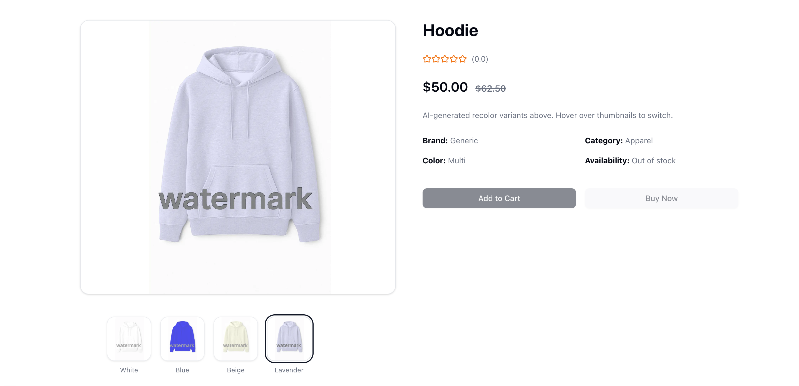

Absolutely! Here's a polished and **GitHub-ready** version of your `README.md` that should render perfectly, including working shields, correct markdown formatting, and image preview compatibility.

Make sure `preview.png` is in the **root of the repository**, and you're good to go 🚀

---

```md
# 🛍️ Cloudinary AI Re‑Color Demo Store

<p align="center">
  
</p>

<p align="center">
  <a href="https://nextjs.org/">
    
  </a>
  <a href="https://cloudinary.com/">
    
  </a>
  <a href="https://tailwindcss.com/">
    
  </a>
  <a href="./LICENSE">
    
  </a>
</p>

A **Next.js 15** sample shop that lets you:

1. Upload one product image.
2. Instantly generate any number of color variants using **Cloudinary’s Generative Recolor** transformation.
3. Overlay a reusable watermark on every variant.
4. Persist product data in a simple JSON file (no database to install).
5. Enjoy a modern UI (Tailwind 4 + shadcn + Motion.dev) with smooth page and hover animations.

---

## 📚 Table of Contents

1. [Prerequisites](#prerequisites)  
2. [Local Setup](#local-setup)  
3. [.env Configuration](#env-configuration)  
4. [One‑Time Watermark Upload](#one-time-watermark-upload)  
5. [Available Scripts](#available-scripts)  
6. [Deploying](#deploying)  
7. [Useful Links](#useful-links)

---

## ✅ Prerequisites

- **Node 18+** (the demo was built on 20.x)  
  ```bash
  nvm install 20 && nvm use 20
  ```
- A **Cloudinary** account (free tier works)  
  → grab your **Cloud Name**, **API Key**, and **API Secret** from  
  *Dashboard ▸ Programmable Media ▸ Account Details*

---

## 🚀 Local Setup

```bash
# 1. Clone repo & install deps
git clone https://github.com/musebe/cloudinary-ai-recolor.git
cd cloudinary-ai-recolor
npm install  # or pnpm / yarn / bun

# 2. Add environment variables
cp .env.example .env.local
#    → open .env.local and paste YOUR Cloudinary keys

# 3. Run the dev server
npm run dev
# then browse http://localhost:3000
```

---

## ⚙️ .env Configuration

Create **`.env.local`** in the project root with the following keys:

| Key                                 | Example             | Purpose                                           |
|-------------------------------------|---------------------|---------------------------------------------------|
| `NEXT_PUBLIC_CLOUDINARY_CLOUD_NAME` | `my-cloud`          | Sent to the browser for URL generation            |
| `NEXT_PUBLIC_CLOUDINARY_FOLDER`     | `demo-store`        | Keeps all project assets in one folder            |
| `CLOUDINARY_API_KEY`                | `123456789012345`   | Used server-side only for signed uploads          |
| `CLOUDINARY_API_SECRET`             | `s0m3-sup3r-s3cr3t` | Same as above                                     |

> **Never commit real keys** — `.env.local` is already in `.gitignore`.

---

## 🖼️ One‑Time Watermark Upload

The project expects an asset at **`demo-store/watermark.png`**.  
Run the snippet below **once** (after you’ve created `.env.local`) to push your watermark into Cloudinary:

```bash
node - <<'JS'
const { v2: cld } = require('cloudinary');
cld.config({
  cloud_name: process.env.NEXT_PUBLIC_CLOUDINARY_CLOUD_NAME,
  api_key:    process.env.CLOUDINARY_API_KEY,
  api_secret: process.env.CLOUDINARY_API_SECRET
});
cld.uploader.upload('watermark.png', {
  folder:    process.env.NEXT_PUBLIC_CLOUDINARY_FOLDER,
  public_id: 'watermark'
}).then(r => console.log('✅  Watermark uploaded →', r.secure_url))
  .catch(console.error);
JS
```

---

## 🛠 Available Scripts

| Command                            | What it does                                   |
|-----------------------------------|------------------------------------------------|
| `npm run dev`                     | Local development (Next.js 15 + Fast Refresh)  |
| `npm run build && npm run start` | Production build & server                      |
| `npm run lint`                    | ESLint + `tsc --noEmit` type-checking         |

---

## 🌍 Deploying

The repo is **Vercel-ready**:

1. Push to GitHub / GitLab / Bitbucket  
2. “Import” the repo into Vercel  
3. Add the same four env vars from `.env.local`  
4. Click **Deploy** 🚀

> Works great with **Netlify** or **Render** too — just set env vars.

---

## 🔗 Useful Links

- 📘 [Generative Recolor docs](https://cloudinary.com/documentation/transformation_reference#e_gen_recolor)
- 💫 [Motion.dev animations](https://motion.dev)
- 🧠 [Next.js Image optimization](https://nextjs.org/docs/app/building-your-application/optimizing/images)
- 🛠 [shadcn/ui](https://ui.shadcn.com)

---

Enjoy building — and recoloring — your store! 🌈🛒
```

---